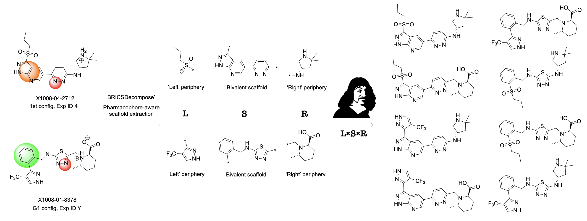

# Scaffold Decorator for the LEGION Workflow

[](https://opensource.org/licenses/MIT)
[](https://www.python.org/downloads/)
[](https://www.rdkit.org/)
[](https://chemrxiv.org/engage/chemrxiv/article-details/68906171fc5f0acb52adf532)

### A Python package for generating molecules by combining molecular scaffolds with decorations.

The code and data to reproduce combinatorial generation of molecular structures from LEGION workflow.

Read the preprint:
[Molecular LEGION: Latent Enumeration, Generation, Integration, Optimization and Navigation. A case study of incalculably large chemical space coverage around the NLRP3 target](https://chemrxiv.org/engage/chemrxiv/article-details/68906171fc5f0acb52adf532)



## 🎯 Quick Start

### Installation

```bash
# Create and activate environment
conda create -n scaffold_decorator python=3.9.18
conda activate scaffold_decorator

# Install RDKit
conda install -c conda-forge rdkit

# Install package and dependecies
pip install -e .
```

### 📁 Input files

All required input data are available in the `input/` derictory:
 - unique_scaffolds.csv
 - unique_left_decorations.csv
 - unique_right_decorations.csv

### 🎲 Decorate scaffolds

```bash
# Random generation - N random molecules
generate-random -n 100

# Systematic generation - all combinations with sampling of 64 decorations in every position
generate
```

## ⚙️ Custom options

```bash
# Random generation with custom parameters
generate-random \
    --scaffolds-csv <path to scaffolds csv> \
    --left-decorations-csv <path to left decorations csv> \
    --right-decorations-csv <path to right decorations csv> \
    --n-molecules 100 \
    --output <path to output csv> \
    --no-randomize-scaffolds \
    --no-randomize-decorations

# Adaptive generation with custom parameters
generate-random \
    --scaffolds-csv <path to scaffolds csv> \
    --left-decorations-csv <path to left decorations csv> \
    --right-decorations-csv <path to right decorations csv> \
    --n-molecules 100 \
    --output <path to output csv> \
    --sampling thompson \
    --usage-penalty 0.1 \
    --seed 42

# Systematic generation with custom parameters
generate \
    --scaffolds-csv <path to scaffolds csv> \
    --left-decorations-csv <path to left decorations csv> \
    --right-decorations-csv <path to right decorations csv> \
    --output-dir <path to output directory> \
    --decorations-sample-size 10 \
    --save-every 1 \
    --no-shuffle
```

## 📋 Parameters

### Random Generation (`generate_random.py`)

| Parameter | Description | Default |
|-----------|-------------|---------|
| `--scaffolds-csv` | CSV file with scaffolds | `/input/unique_scaffolds.csv` |
| `--left-decorations-csv` | CSV file with left decorations | `/input/unique_left_decorations.csv` |
| `--right-decorations-csv` | CSV file with right decorations | `/input/unique_right_decorations.csv` |
| `-n, --n-molecules` | Number of molecules to generate | required |
| `--output` | Output CSV file | `output/random_molecules.csv` |
| `--no-randomize-scaffolds` | Use scaffolds systematically | `False` |
| `--no-randomize-decorations` | Use decorations systematically | `False` |

### Systematic Generation (`generate.py`)

| Parameter | Description | Default |
|-----------|-------------|---------|
| `--scaffolds-csv` | CSV file with scaffolds | `/input/unique_scaffolds.csv` |
| `--left-decorations-csv` | CSV file with left decorations | `/input/unique_left_decorations.csv` |
| `--right-decorations-csv` | CSV file with right decorations | `/input/unique_right_decorations.csv` |
| `--output-dir` | Output directory | `/output` |
| `--decorations-sample-size` | Number of decorations to sample | `64` |
| `--save-every` | Save results every N scaffolds | `10` |
| `--no-shuffle` | Don't shuffle scaffolds | `False` |


### Adaptive Generation (New)

The random generator now supports intelligent sampling using Multi-Armed Bandit algorithms to prioritize valid and unique molecules.

```bash
# Standard Uniform Random (Default)
generate-random -n 1000 --sampling uniform

# Thompson Sampling (Adaptive)
generate-random -n 1000 --sampling thompson --usage-penalty 0.1
```

| Parameter | Description | Default |
|-----------|-------------|---------|
| `--sampling` | Strategy: `uniform` (default), `thompson`, `ucb` | `uniform` |
| `--usage-penalty` | Penalize repeated usage to ensure diversity (0.0 - 1.0) | `0.0` |
| `--seed` | Random seed for reproducibility | `None` |

**When to use?**
*   **Uniform**: Best for clean, high-quality datasets.
*   **Thompson/UCB**: Best for "noisy" datasets (many invalid combinations) or exploring difficult chemical spaces. It learns to avoid failures.


## 📋 Data Format

**Input CSV files** must contain a `smiles` column:

```csv
smiles
c1ccc([*:1])cc1
[*:1]c1ccc([*:2])cc1
```

**Output CSV files** contains:

```csv
smiles,scaffold,left_decoration,right_decoration
Cc1ccccc1O,c1ccc([*:1])cc1,[*:1]C,[*:2]O
```

---

**License:**

This project is licensed under the MIT License - see the [LICENSE](LICENSE) file for details.
